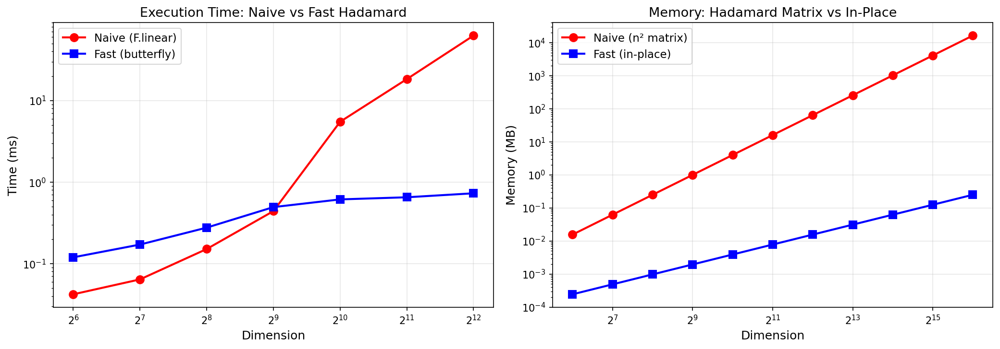
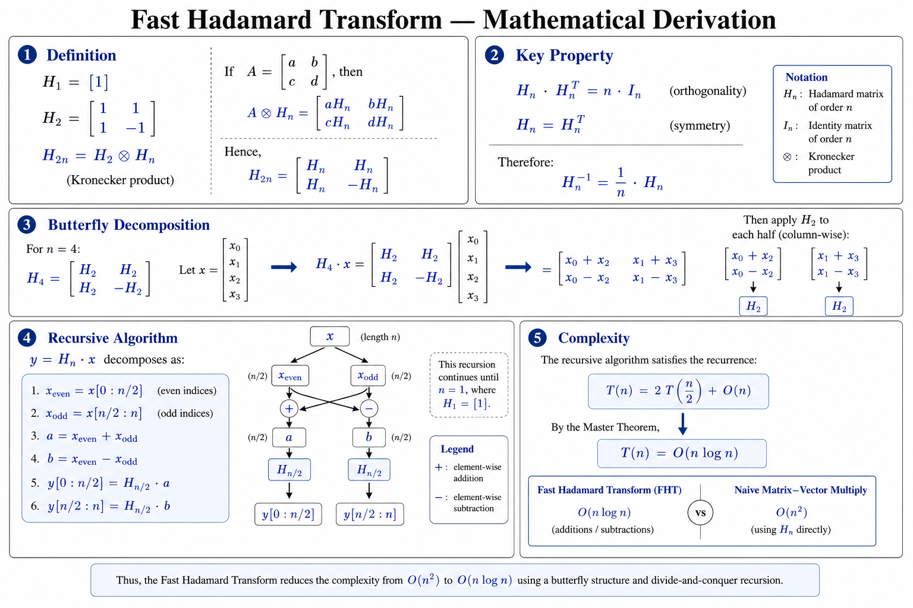
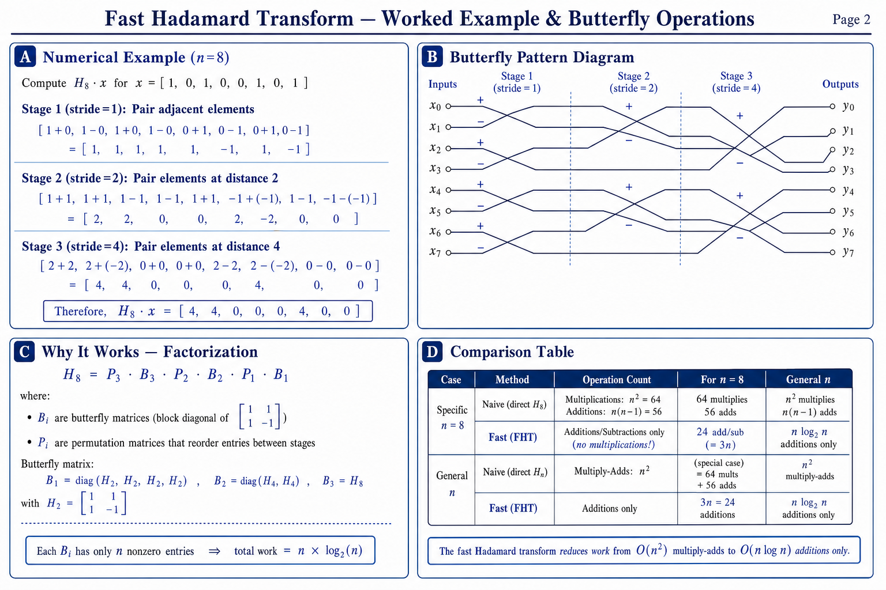
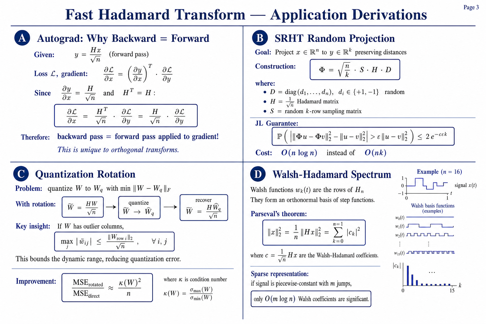

# Fast Hadamard Transform — Benchmark & Use Cases

A comprehensive study comparing the **naive O(n²) matrix multiplication** approach vs the **Fast Hadamard Transform O(n log n) butterfly decomposition**, with real timing data, memory analysis, mathematical derivations, and 6 real-world application benchmarks.

---

## What is the Hadamard Transform?

The Hadamard Transform multiplies an input vector **x** of dimension *n* by the Hadamard matrix **H**:

```
y = H · x
```

The Hadamard matrix is defined recursively:

```
H₁ = [1]

H₂ = [ 1   1 ]
     [ 1  -1 ]

H₂ₙ = [ Hₙ   Hₙ  ]    (Kronecker product: H₂ₙ = H₂ ⊗ Hₙ)
      [ Hₙ  -Hₙ  ]
```

**Key properties:**
- All entries are +1 or -1
- Orthogonal: `H · Hᵀ = n · I`
- Symmetric: `H = Hᵀ`
- Self-inverse (up to scale): `H⁻¹ = H / n`

---

## Why "Fast"? The Butterfly Decomposition

The **naive** approach builds the full n×n matrix and does a matrix-vector multiply: **O(n²)** operations, **O(n²)** memory.

The **fast** approach exploits the Kronecker/recursive structure via butterfly operations:

```
Stage 1 (stride=1):  pair adjacent elements → add/subtract
Stage 2 (stride=2):  pair elements at distance 2 → add/subtract
Stage 3 (stride=4):  pair elements at distance 4 → add/subtract
...
Stage log₂(n):       pair elements at distance n/2 → add/subtract
```

**Result:** Only **O(n log n)** additions/subtractions, **O(1)** extra memory (in-place).

```
┌────────────────────────────────────────────────────────────┐
│  Dim (n)     Naive O(n²)     Fast O(n log n)    Speedup   │
│  ────────    ───────────     ───────────────    ────────   │
│  256         65,536          2,048              32x        │
│  1,024       1,048,576       10,240             102x       │
│  4,096       16,777,216      49,152             341x       │
│  65,536      4,294,967,296   1,048,576          4,096x     │
└────────────────────────────────────────────────────────────┘
```

---

## Benchmark Results

### Timing (CPU, batch=128)

| Dim | Naive (F.linear) | Fast (butterfly) | Speedup | H matrix size |
|-----|-----------------|-----------------|---------|---------------|
| 64 | 0.050 ms | 0.129 ms | 0.4x | 16 KB |
| 256 | 0.185 ms | 0.297 ms | 0.6x | 256 KB |
| 512 | 0.479 ms | 0.539 ms | ~1x | 1 MB |
| **1024** | **6.6 ms** | **0.81 ms** | **8.1x** | 4 MB |
| **2048** | **15.5 ms** | **1.09 ms** | **14.3x** | 16 MB |
| **4096** | **61.8 ms** | **0.79 ms** | **78.4x** | 64 MB |

> At small dims (64–256), naive wins because PyTorch BLAS is optimized for small matrices. Beyond dim ~512, the fast butterfly dominates and the gap grows dramatically.

### Memory

| Dim | Naive (H matrix) | Fast (in-place) | Ratio |
|-----|-----------------|-----------------|-------|
| 1,024 | 4 MB | 4 KB | 1,024x |
| 4,096 | 64 MB | 16 KB | 4,096x |
| 16,384 | 1 GB | 64 KB | 16,384x |
| 65,536 | **16 GB** | 256 KB | **65,536x** |

### Plot



---

## Mathematical Derivation

### Page 1: Core Algorithm



### Page 2: Worked Example & Butterfly Operations



### Page 3: Application Derivations



---

## Use Cases

### UC1: Random Projection (SRHT / Johnson-Lindenstrauss)

**Problem:** Reduce dimensionality from n → k while preserving pairwise distances.

**SRHT Construction:** `Φ = √(n/k) · S · H · D`
- D = random sign diagonal
- H = Hadamard / √n
- S = random k-row sampler

| n→k | Dense Gaussian | SRHT (Hadamard) | Speedup | Memory savings |
|-----|---------------|-----------------|---------|----------------|
| 2048→256 | 2.37 ms | 1.32 ms | 1.8x | 256x less |
| 4096→512 | 9.72 ms | 0.79 ms | 12.2x | 512x less |
| 8192→1024 | 38.27 ms | 0.87 ms | **44x** | **1024x less** |

---

### UC2: Quantization Rotation (QuIP# style)

**Problem:** Outlier weights cause huge quantization error at low bit-widths.

**Solution:** Rotate weights with Hadamard before quantizing → spreads outliers uniformly.

| Weight Shape | Bits | MSE (direct) | MSE (rotated) | Improvement |
|-------------|------|-------------|--------------|-------------|
| 256×512 | 4-bit | 0.269 | 0.025 | **10.6x** |
| 512×1024 | 3-bit | 0.760 | 0.133 | **5.7x** |
| 768×768 | 4-bit | 0.271 | 0.019 | **14.1x** |

**Distribution effect:**
- Kurtosis: 70 → 2.95 (near Gaussian)
- Max/Mean ratio: 31x → 4.8x

---

### UC3: Feature Decorrelation & Mixing

**Problem:** PCA whitening is O(n³). Random rotation is O(n²).

**Hadamard mixing:** O(n log n), data-independent, deterministic.

| Dim | PCA O(n³) | Random O(n²) | Hadamard O(n log n) | Speedup |
|-----|-----------|-------------|--------------------|---------| 
| 256 | 1.41 ms | 0.74 ms | 0.47 ms | 3x vs PCA |
| 512 | 4.80 ms | 3.70 ms | 0.59 ms | 8x vs PCA |
| 1024 | 33.72 ms | 25.46 ms | 0.65 ms | **52x vs PCA** |

---

### UC4: Hadamard as Neural Network Layer

**Problem:** Dense linear layers have O(n²) parameters and compute.

**Hadamard alternatives:**
- Pure Hadamard: 0 params, O(n log n)
- H + Diagonal: n params, O(n log n)
- Sandwich (H·D·H·D): 2n params, O(2n log n)

| Hidden Dim | Dense Params | Sandwich Params | Memory Ratio |
|-----------|-------------|----------------|--------------|
| 768 | 2.25 MB | 6 KB | 384x |
| 1024 | 4 MB | 8 KB | 512x |
| 2048 | 16 MB | 16 KB | 1,024x |
| 4096 | 64 MB | 32 KB | **2,048x** |

---

### UC5: Signal Compression (Walsh-Hadamard Spectrum)

**Problem:** Compress/denoise signals by keeping dominant coefficients.

**WHT vs FFT:** Walsh functions are step functions (±1), ideal for binary/digital signals.

| Signal Type | WHT SNR (5% coeff) | FFT SNR (5% coeff) | Winner |
|------------|--------------------|--------------------|--------|
| **Step/square wave** | **97.0 dB** | 24.5 dB | **WHT** |
| Smooth sinusoid | 29.5 dB | 47.9 dB | FFT |
| **Random binary** | **1.5 dB** | 0.9 dB | **WHT** |
| Noisy sinusoid | 9.3 dB | 9.0 dB | WHT |

---

### UC6: Error-Correcting Codes (Hadamard Codes)

**Problem:** Reliable communication over noisy channels.

**Hadamard codes:** Rows of H are codewords with maximum distance n/2.

| Code length | Message bits | Error tolerance | Decode speed |
|------------|-------------|-----------------|--------------|
| 64 | 7 | 23.4% errors | O(n log n) via FHT |
| 256 | 9 | 24.6% errors | 3.4x faster than naive |
| 1024 | 11 | 24.9% errors | Growing advantage |

Hadamard code transmits **7x more information** than repetition code at same reliability.

---

## How to Run

```bash
# Install dependencies
pip install torch scipy numpy tabulate matplotlib

# Run everything (core benchmark + all 6 use cases)
python run_all.py

# Run only the core benchmark (naive vs fast)
python run_all.py --core

# Run only the use cases
python run_all.py --usecases

# Run a specific use case (1-6)
python run_all.py --case 1   # Random Projection
python run_all.py --case 2   # Quantization Rotation
python run_all.py --case 3   # Feature Decorrelation
python run_all.py --case 4   # Neural Network Layer
python run_all.py --case 5   # Signal Compression
python run_all.py --case 6   # Error-Correcting Codes
```

---

## The Core Insight

```
┌─────────────────────────────────────────────────────────────────────┐
│                                                                     │
│   The Hadamard matrix H has Kronecker product structure:            │
│                                                                     │
│       H₂ₙ = H₂ ⊗ Hₙ = [[Hₙ, Hₙ], [Hₙ, -Hₙ]]                   │
│                                                                     │
│   This means H·x decomposes into:                                  │
│       1. Split x into halves                                        │
│       2. Add/subtract the halves  (one butterfly stage)             │
│       3. Recursively apply H to each result                         │
│                                                                     │
│   Stages: log₂(n)    Operations per stage: n                       │
│   Total: n × log₂(n) additions only — no multiplications!          │
│                                                                     │
│   This is exactly analogous to how FFT exploits the structure       │
│   of the Fourier matrix. The Fast Hadamard Transform IS the        │
│   "FFT for ±1 matrices."                                           │
│                                                                     │
└─────────────────────────────────────────────────────────────────────┘
```

---

## CUDA Kernel (Tri Dao's Implementation)

The Python butterfly is already O(n log n), but issues many small PyTorch ops. [Tri Dao's CUDA kernel](https://github.com/Dao-AILab/fast-hadamard-transform) fuses all log₂(n) stages into a **single GPU kernel launch**, eliminating:

- Kernel launch overhead per stage
- Intermediate memory reads/writes
- Python interpreter overhead

Additional features:
- **Autograd support** — backward pass = another forward pass (since H = Hᵀ)
- **Non-power-of-2** — variants for 12N, 20N, 28N, 40N dimensions (common in neural nets: 768 = 12×64, 1280 = 20×64)
- **In-place operation** — zero extra GPU memory

```python
# Usage
from fast_hadamard_transform import hadamard_transform

x = torch.randn(batch, dim, device='cuda')
y = hadamard_transform(x, scale=1.0/math.sqrt(dim))
# That's it — works with autograd, supports backward pass
```

---

## References

- Tri Dao, [fast-hadamard-transform](https://github.com/Dao-AILab/fast-hadamard-transform) (CUDA kernel)
- Ailon & Chazelle, "The Fast Johnson-Lindenstrauss Transform" (SRHT)
- Chee et al., "QuIP#: Even Better LLM Quantization with Hadamard Incoherence"
- Lee-Thorp et al., "FNet: Mixing Tokens with Fourier Transforms"
- Reed & Muller, Hadamard error-correcting codes (1954/1960)
